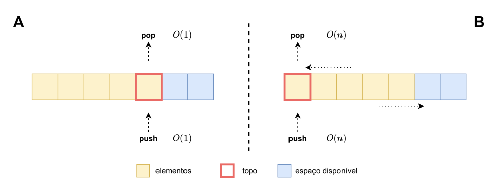
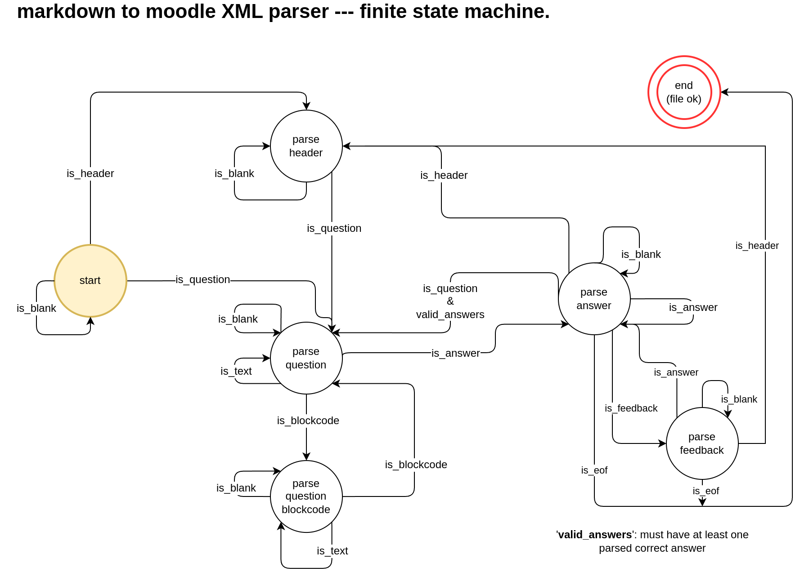

markdown2moodle
===

This tool is able to convert a quiz in *markdown* format to *Moodle's XML* format.

It stemed from the project [GitHub - brunomnsilva/markdown-to-moodle-xml](https://github.com/brunomnsilva/markdown-to-moodle-xml) that was itself a *fork*. This project is an evolution of that parser, using a *finite state machine*, and should be preferred as it is more robust, provides error checking and more complex code snippets in the quizes.

I'm currently using this script to produce Moodle quizes for *computer science* classes at the *Polytechnic of Setúbal - Portugal*.

## Features and Limitations

* Each *markdown* file can have any number of categories, sub-categories and questions.

* Questions can contain text, latex math expressions (single and double dollar), code blocks, inline code and images;

* Answers only allow text, latex expressions and inline code;

* Code blocks can be converted into images that are embedded into the XML file. The lexer specifies the language that will be used for syntax highlighting. This happens when using the `{img}` option (see *example.md*);

* The markdown format and parser only predict **multiple choice** questions at this time, although `true/false` questions can be easily replicated (see *example.md*);

* Markdown Tables are not supported yet;

* Question and answer feedback are not supported yet.

## Example

A full example using all available features is avalable in *example.md*, which you can test yourself.

Nonetheless, a portion of it to illustrate the quiz format in markdown is presented below:

```markdown
# DummyCategory/Subcategory

* Consider the following function:

$$fib(n)=\left\{\begin{matrix} 1 & n = 0\\  1 & n = 1\\ fib(n-1) + fib(n-2) & n > 1 \end{matrix}\right.$$

Mark the correct statements about `fib(n)`:

    - !It's a recursive function

    - It's defined for all integers

    - It has $O(n)$ time complexity

    - !It has $O(2^n)$ time complexity

* Consider the following code that uses the ADT Stack:

`` ```cpp
PtStack s1 = stackCreate(10);
PtStack s2 = stackCreate(10);
for(int i=0; i<4; i++) {
    stackPush(s1, (i+1) );
}
int elem1, elem2;
while(!stackIsEmpty(s1)) {
    stackPop(s1, &elem1);
    if(!stackIsEmpty(s2)) {
        stackPop(s2, &elem2);
        stackPush(s2, (elem1 + elem2) );
    } else {
        stackPush(s2, elem1);
    }
}
//s1 = ? s2 = ?
`` ```

What's the contents of the stacks `s1` e `s2` (from **bottom to top**) after the second loop?
    - !`s1 = {} e s2 = {10}`
    - `s1 = {1,2,3,4} e s2 = {4,7,9,10}`
    - `s1 = {} e s2 = {6}`
    - Other answer

* Consider the parcial specification of the ADT Complex and the following code:

`` ```cpp{img}
#define COMPLEX_OK      0
#define COMPLEX_NULL    1

/**
 * @brief Retrieve the imaginary part of the complex number.
 *
 * @param c [in] PtComplex pointer to the number's data structure.
 * @param im [out] Address of variable to hold result
 *
 * @return COMPLEX_OK and imaginary part assigned to '*im'
 * @return COMPLEX_NULL if 'c' is NULL
 */
int complexIm (PtComplex c, double *im);

//----

PtComplex a = complexCreate(1, 8);
`` ```

How to get the imaginary component of the complex number `a`?
    - !`double im = 0; complexIm(a, &im);`
    - `int im = complexIm(a);`
    - `double im = a->im;`
    - `double im = 0; complexIm(a, im);`

* Consider the following two approaches for implementing the **ADT Stack** using an *array list*:



Which one would you choose for better eficiency?

    - !Approach **A**
    - Approach **B**

```

* Categories are specified via *markdown sections*. Note the use of `/` to specify subcategories (you can further create a subcategory of a subcategory).

* Questions start with `*` will include all content until the first answer;

* Answers start with `-`; correct answers must have the prefix `!`;

* Text allows any markdown formatting, e.g., **bold** and *italic*;

* Images are included normally, as in any markdown file, including by an external *url*.

* Code blocks are included using *backticks* followed by the *lexer*, as in any markdown file. If using `{img}` after the lexer, then the code will be converted to a *png* image with syntax highlighting; personally, I prefer this method. Otherwise, it wil be in plain text.

All images are encoded to *base64* and included in the output, so the resulting XML is self-contained and ready to import into *Moodle*.

## How to Use

### Prerequistes

This is a *python* script, so obviously you'll need `python` installed.

You'll also need the following python libraries installed:

* markdown (mandatory) 

    - `$> pip install markdown --user`

* pygments (optional, only used to generate images from code blocks)

    - `$> pip install pygments --user`

### Conversion

Just run the script against your markdown file, e.g.:

```
$> python md2moodle.py example.md
```

This will produce the corresponding *Moodle XML* files, one per each category or subcategory specified in the *markdown* file.

* If your markdown file contains any errors, the parser will stop at the first encountered error, telling you which error exists and at which line. Example:

    ```
    Error at line 21: Expecting text, codeblock or answer.
    ```

### Configuration

The script includes some *configurations* that can be manually modified, namely:

```python
CONFIG = {
    # Produce debugging information while parsing
    'debug' : False,
    
    # quiz answer numbering | allowed values: 'none', 'abc', 'ABCD' or '123'
    'answer_numbering' : 'abc', 

    # pygments code snapshot generator
    'pygments.font_size' : 16,
    'pygments.line_numbers' : False,

    # pygments code snapshot | additional dump to disk of generated images
    'pygments.dump_image' : False,
    'pygments.dump_image_id' : 1, #e,g, 1.png and incremented for each image
}
```

## Contribute

You're very welcome to contribute to this project, either via *issues* or **pull request**.

### Technical aspects

The *markdown* parser is implemented using a *finite state machine* (FSM) implementation. This allows for a more robust parsing and error reporting.

Current states and transitions are depicted bellow; all other transitions result in error, e.g., when in `parse_question` the *parsed line* is a *header*.



To extend the FSM to include *feedback* information in questions, the following steps would be required:

* Create the corresponding *regex* expression, for example, if using a markdown blockquote `>`;

* Extend the `Quiz` class to include *feedback* for question and/or answers;

* Create the state handler and add it to the FSM;

    * This handler must include all logic for state transitions.

In the future I'll be addressing this feature, but feel free to take on the challenge :smile:

## License

The code is made available under the *GNU GENERAL PUBLIC LICENSE* -- see *LICENCE.md*.