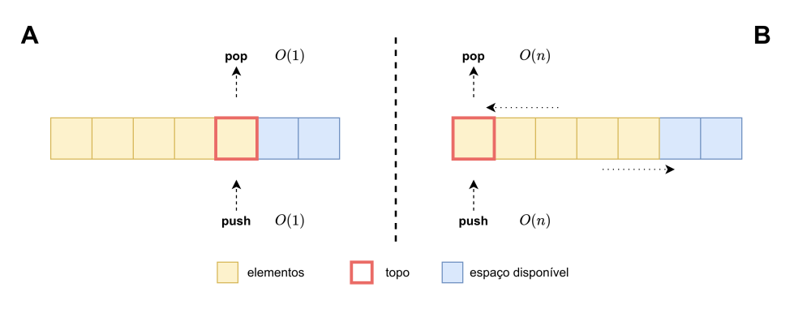
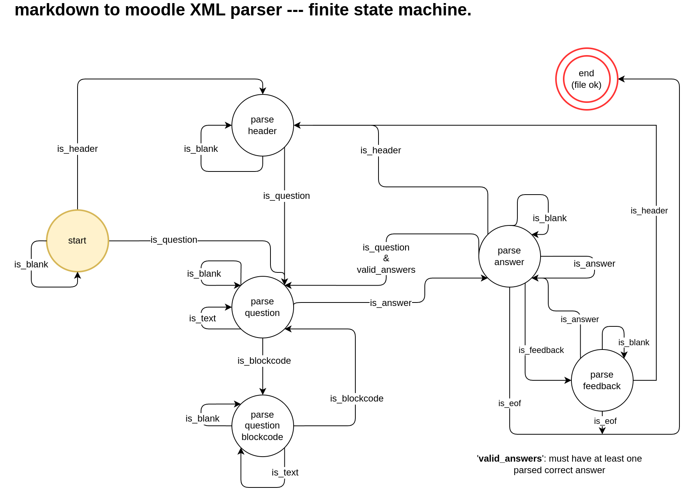

markdown2moodle
===

This tool is able to convert a quiz in *markdown* format to *Moodle's XML* format.

It stemed from the project [GitHub - brunomnsilva/markdown-to-moodle-xml](https://github.com/brunomnsilva/markdown-to-moodle-xml) that was itself a *fork*. This project is an evolution of that parser, using a *finite state machine*, and should be preferred as it is more robust, provides error checking and more complex code snippets in the quizes.

I'm currently using this script to produce Moodle quizes for *computer science* classes at the *Polytechnic of Setúbal - Portugal*.

## Features and Limitations

> [!WARNING]
> Version 2 breaks the previous input format.
>
> You can still use Version 1 from the **Releases** section.

* Version 2 (since Nov 17, 2025 -- current working tree)

    * The new quiz format now requires starting a question with `---` (with optional content following it). This allows for more complex content, including *bullet lists* without any "hacks" (e.g., use of `+` for unordered lists).

    * We can include html comments `<!-- -->` that will be stripped out from the output. Comments inside code (inline code or fenced code blocks) are preserved, e.g. when authoring an HTML question.

    * Some Moodle instances can have an *emoticon parser* activated, that will, for example, change `(n)`, e.g., in `fib(n)`, into `fib👎`. All *emoticons*  are dealt properly - inserting zero-width spacing to fool the Moodle parser. If you still wish to include *emojis*, just put the unicode character in the source file. 

    * Question names are generated deterministically from the question text, so re-exporting the same document yields stable names. The quiz is considered invalid if two questions (anywhere, across all categories) end up with the same name.

    * Generated output files are placed in a local `out` directory.

    * Started some code refactoring to allow different output formats in the future - currently only *Moodle XML format* is available.

* Version 1 (until Jul 21, 2024)

    * Each *markdown* file can have any number of categories, sub-categories and questions.

    * Questions can contain text, latex math expressions (single and double dollar), code blocks, inline code and images;

    * Answers only allow text, latex expressions and inline code;

    * Code blocks can be converted into images that are embedded into the XML file. The lexer specifies the language that will be used for syntax highlighting. This happens when using the `{img}` option (see [example.md](example.md));

    * The markdown format and parser only predict **multiple choice** questions at this time, although `true/false` questions can be easily replicated (see [example.md](example.md));

    * <del>Markdown Tables are not supported yet;</del>  Markdown tables supported through `[[[ ]]]` *custom environment* (see [example.md](example.md))

    * <del>Question and answer feedback are not supported yet.</del> Answer feedback can be provided, using the `>` symbol (see [example.md](example.md))

## Example

A full example using all available features is avalable in [example.md](example.md), which you can test yourself.

Nonetheless, a portion of it to illustrate the quiz format in markdown is presented below:

~~~markdown
# DummyCategory/Programming/ADT

Consider the following function:

$$fib(n)=\left\{\begin{matrix} 1 & n = 0\\  1 & n = 1\\ fib(n-1) + fib(n-2) & n > 1 \end{matrix}\right.$$

Mark the correct statements about `fib(n)`:

- !It's a recursive function
- It's defined for all integers
- It has $O(n)$ time complexity
- !It has $O(2^n)$ time complexity

---

Consider the following code that uses the ADT Stack:

```cpp
PtStack s1 = stackCreate(10);
PtStack s2 = stackCreate(10);
for(int i=0; i<4; i++) {
    stackPush(s1, (i+1) );
}
int elem1, elem2;
while(!stackIsEmpty(s1)) {
    stackPop(s1, &elem1);
    if(!stackIsEmpty(s2)) {
        stackPop(s2, &elem2);
        stackPush(s2, (elem1 + elem2) );
    } else {
        stackPush(s2, elem1);
    }
}
//s1 = ? s2 = ?
```

What's the contents of the stacks `s1` e `s2` (from **bottom to top**) after the second loop?

- !`s1 = {} e s2 = {10}`
- `s1 = {1,2,3,4} e s2 = {4,7,9,10}`
- `s1 = {} e s2 = {6}`
- Other answer

---

Consider the parcial specification of the ADT Complex and the following code:

```cpp{img}
#define COMPLEX_OK      0
#define COMPLEX_NULL    1

/**
 * @brief Retrieve the imaginary part of the complex number.
 *
 * @param c [in] PtComplex pointer to the number's data structure.
 * @param im [out] Address of variable to hold result
 *
 * @return COMPLEX_OK and imaginary part assigned to '*im'
 * @return COMPLEX_NULL if 'c' is NULL
 */
int complexIm (PtComplex c, double *im);

//----

PtComplex a = complexCreate(1, 8);
```

How to get the imaginary component of the complex number `a`?

- !`double im = 0; complexIm(a, &im);`
- `int im = complexIm(a);`
- `double im = a->im;`
- `double im = 0; complexIm(a, im);`

---

Consider the following two approaches for implementing the **ADT Stack** using an *array list*:



Which one would you choose for better eficiency?

- !Approach **A**
- Approach **B**

# DummyCategory/Math

Is the problem

$$
\begin{array}{ll}
\max & 8x_1 + 3 x_2\\ 
s.t. & 3 x_1 + 8 x_2 \leq 9\\
& x_1 * x_2 \leq 20\\
& x \geq 0
\end{array}
$$

a linear optimization problem?

- yes
- !no

---

What is the point satisfying the inequalities $3x_1 + 4x_2 \leq 8$ and $x_1 + 3x_2 \leq 4$ with equality?

- $x = (\frac{8}{3},0)$
- $x = (\frac{4}{3},1)$
- !$x(\frac{8}{5}, \frac{4}{5})$

~~~

* Categories are specified via *markdown sections*. Note the use of `/` to specify subcategories (you can further create a subcategory of a subcategory).

* Questions start with `---`. Will include all content afterwards until the first answer;

* Answers start with `-`; correct answers must have the prefix `!`;

* Text allows any markdown formatting, e.g., **bold** and *italic*;

* Images are included normally (as well as links) even by an external *url*.

* Code blocks are included using *backticks* followed by the *lexer*, as in any markdown file. If using `{img}` after the lexer, then the code will be converted to a *png* image with syntax highlighting; personally, I prefer this method. Otherwise, it will be exported in plain text.

* All images are encoded to *base64* and included in the output, so the resulting XML is self-contained and ready to import into *Moodle*.

**Important note (1):** Pay particular atention to use spaces after section, question or answers delimiters, e.g., `#`, `---` and `-`.

**Important note (2):** Regular line breaks in markdown are not converted automatically to line breaks in the output. You must **place two spaces** for this to happen. This is a *markdown* standard, e.g.,

```markdown
First paragraph.(two spaces here)

Next paragraph.
```

## How to Use

### Prerequisites

This is a *python* script, so you'll need `python3` installed.

You'll also need the following python libraries:

* **markdown** (mandatory) — used to render markdown to HTML.

* **pygments** (optional, only used to generate images from code blocks) — which uses **PIL** \[python imaging library\].

Install them either with `pip`:

```bash
$> pip install markdown --user        # mandatory
$> pip install pygments --user        # optional, for code block images
```

or, preferably, using your distribution's packages, e.g.:

* Debian/Ubuntu:

    ```bash
    $> sudo apt install python3-markdown python3-pygments python3-pil
    ```

* Fedora:

    ```bash
    $> sudo dnf install python3-markdown python3-pygments python3-pillow
    ```

* Arch Linux:

    ```bash
    $> sudo pacman -S python-markdown python-pygments python-pillow
    ```

If other packages are required in your system, you should be able to discern which ones from the error output.

### Conversion

Just run the script against your markdown file, e.g.:

```markdown
$> python3 md2moodle.py example.md
```

This will produce the corresponding *Moodle XML* files, one per each category or subcategory specified in the *markdown* file.

* If your markdown file contains any errors, the parser will stop at the first encountered error, telling you which error exists and at which line. Example:

    ```markdown
    Error at line 21: Expecting text, codeblock or answer.
    ```

### Configuration

The script includes some *configurations* that can be manually modified, namely:

```python
{   
    # Place table borders through css style?
    'table_border' : True,

    # quiz answer numbering | allowed values: 'none', 'abc', 'ABCD' or '123'
    'answer_numbering' : 'abc', 

    # quiz shuffle answers 
    'shuffle_answers' : True,

    # in single answer questions, the penalty to apply to a wrong answer in % [0,1]
    'single_answer_penalty_weight' : 0, #e.g., 0.25 = 25% 

    # pygments code snapshot generator
    # Font used to render code-block images. Empty uses Pygments' platform
    # default (DejaVu Sans Mono on Linux); may be a font name or a .ttf path.
    'pygments.font_name' : '',
    'pygments.font_size' : 16,
    'pygments.line_numbers' : False,

    # pygments code snapshot | additional dump to disk of generated images
    'pygments.dump_image' : False,
    'pygments.dump_image_id' : 1, #e.g., 1.png and incremented for each image
}
```

#### Code block images and fonts

Code blocks marked with `{img}` are rendered to a PNG using a monospace font.
By default, Pygments uses **DejaVu Sans Mono** on Linux. If that font is not
installed, the script fails with an error such as:

```markdown
FontNotFound: No usable fonts named: "DejaVu Sans Mono"
```

To fix this, either install the default font on your system, e.g.:

* Debian/Ubuntu: `$> sudo apt install fonts-dejavu`
* Fedora: `$> sudo dnf install dejavu-sans-mono-fonts`
* Arch Linux: `$> sudo pacman -S ttf-dejavu`

or set `'pygments.font_name'` to any installed monospace font (or to the path
of a `.ttf` file), e.g.:

```python
'pygments.font_name' : 'Noto Sans Mono',
```

## Contribute

You're very welcome to contribute to this project, either via *issues* or **pull request**.

### Technical aspects

The *markdown* parser is implemented using a *finite state machine* (FSM) implementation. This allows for a more robust parsing and error reporting.

Current states and transitions are depicted bellow; all other transitions result in error, e.g., when in `parse_question` the *parsed line* is a *header*.



To extend the FSM to include *feedback* information in questions, the following steps would be required:

* Create the corresponding *regex* expression, for example, if using a markdown blockquote `>`;

* Extend the `Quiz` class to include *feedback* for question and/or answers;

* Create the state handler and add it to the FSM;

    * This handler must include all logic for state transitions.

<del>In the future I'll be addressing this feature, but feel free to take on the challenge</del> I've addressed this already :smile:

## License

The code is made available under the *GNU GENERAL PUBLIC LICENSE* -- see *[LICENCE](LICENSE)*.
